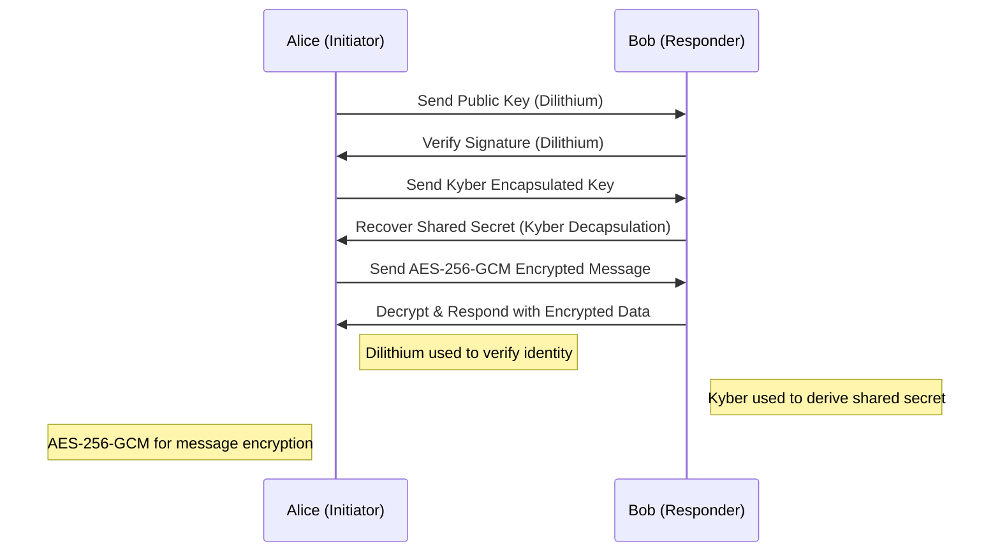
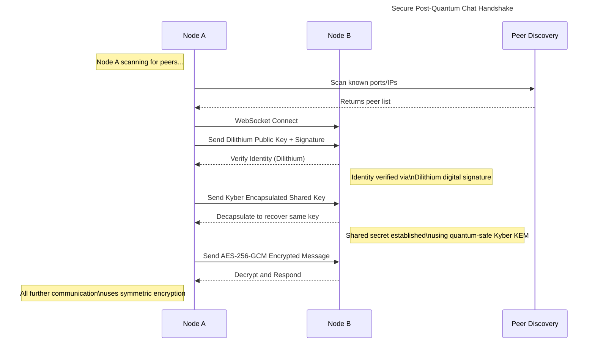
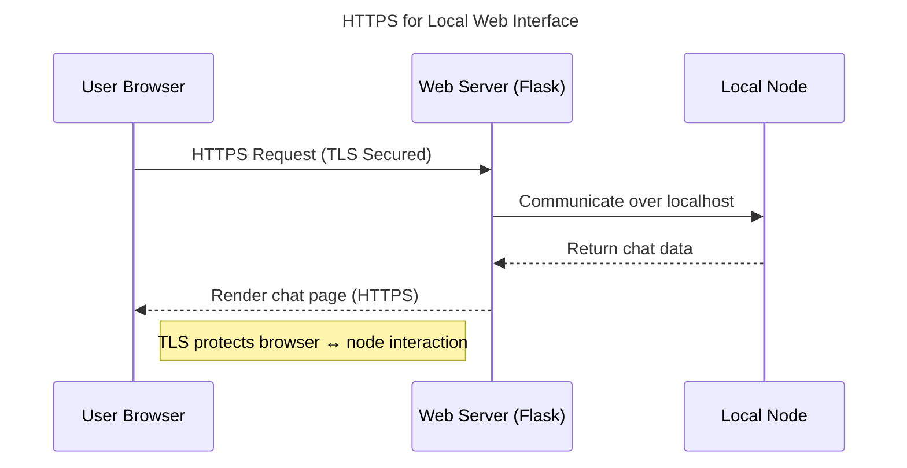
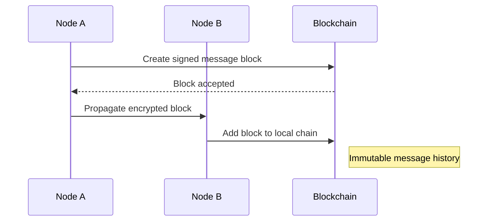

## Notes

- `Dilithium` is used for `digital signatures`
- `Kyber` is used for `key exchange` (not identities)

### So, why does Kyber generate keys?
- Because Kyber generates ephemeral key pairs for secure communication , not for long-term identity. 

|FEATURE|DILITHIUM|KYBER|
|---|---|---|
|Purpose|Digital signatures|Key exchange
|Used for|Identities, signing messages|Secure session keys
|Long-term key?|✅ Yes (identity stays the same)|❌ No (ephemeral for each session)
|Example use case|Signing a transaction|Securing a P2P connection
|Generates keys?|✅ Yes (once per identity)|✅ Yes (per session)

## Secure P2P Handshake Using Post-Quantum Crypto

## Full P2P Network with Post-Quantum Identity, and Peer Discovery

## Optional Add-on: Web Interface with HTTPS
If you're adding a web UI (like Flask + HTML), you can show it in a separate flow like this:

This keeps TLS where it belongs — protecting the user’s connection to their own local node.
## Bonus: Add Blockchain Layer if Used for Message Storage
If you're storing messages in blocks on a blockchain:

# DO NOT USE TLS in the P2P layer !!!!