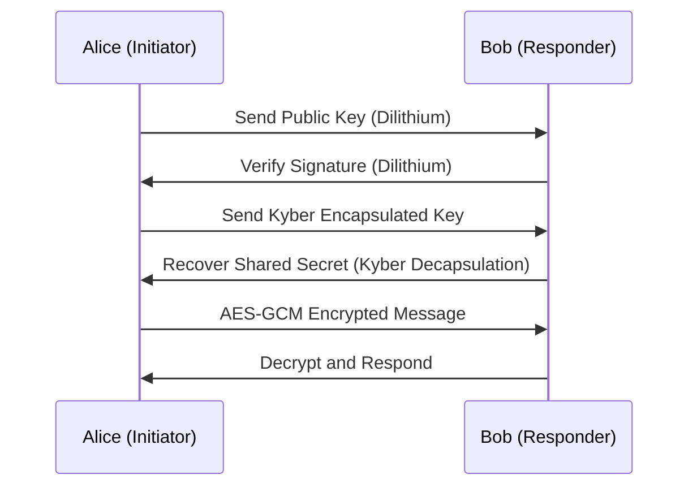
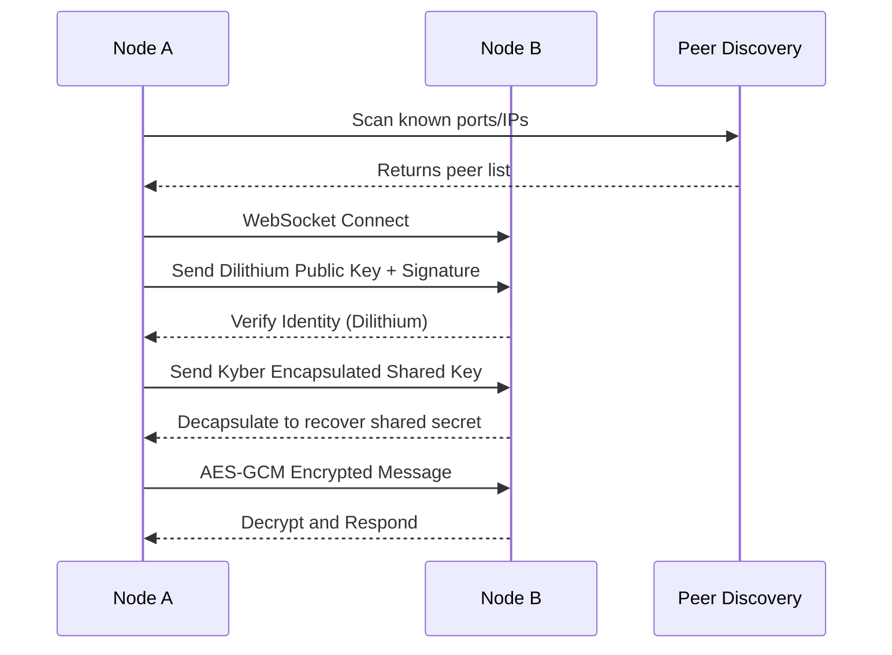
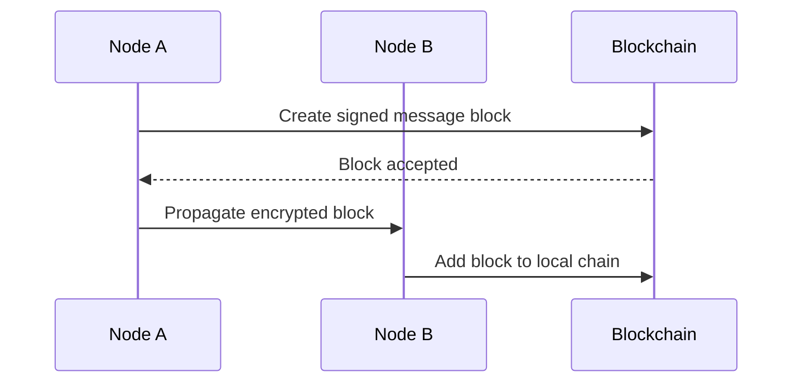

# 🔐 Quantum-Safe Decentralized Chat on Blockchain

Welcome to a next-generation secure communication protocol—an end-to-end encrypted P2P chat system built on a **custom blockchain**, fortified with **post-quantum cryptography**, and engineered for **high-assurance communication** in decentralized networks.

---

## 🧠 System Overview

This project combines **cutting-edge cryptography**, **custom Proof-of-Authority blockchain consensus**, and **real-time communication** through GraphQL and WebSockets. Here's what powers it:

### Core Components:

| Layer              | Technology                    | Description                                                                 |
|-------------------|-------------------------------|-----------------------------------------------------------------------------|
| **Blockchain**     | Custom-made, PoA              | Immutable, synchronized ledger of events/messages across peers             |
| **P2P Network**    | WebSocket + Custom Discovery  | Direct peer discovery and messaging across a decentralized mesh            |
| **Crypto Stack**   | Dilithium + Kyber512 + AES-GCM| Post-quantum secure: Identity, key exchange, and message encryption        |
| **Transport Layer**| GraphQL over WebSocket        | Efficient, typed, and real-time message exchange                           |
| **Frontend**       | React + Next.js + TailwindCSS | Secure, modern UI for chat and identity display                            |

---

## 🚧 Technical Challenges

1. **Post-Quantum Security Integration**  
   Implementing NIST PQC algorithms (Kyber, Dilithium) into real-time P2P systems requires careful handling of key lifetimes, computational cost, and interoperability.

2. **Blockchain Synchronization**  
   Ensuring deterministic block propagation and state convergence using P2P syncing without central authority.

3. **Error Handling in P2P**  
   Malformed messages, invalid signatures, or corrupted keys must be detected and discarded **immediately** to preserve trust in decentralized communications.

4. **Scalability under Real-Time Constraints**  
   Achieving low-latency, encrypted messaging with chain validation in a decentralized environment—without compromising throughput.

---

## 🚀 Breakthrough Innovations

### ✅ Full PQC Handshake (Kyber + Dilithium)

A secure, decentralized identity/authentication protocol:

### 🔗 Blockchain-Powered Message History

- **PoA consensus** avoids computational waste, ideal for controlled P2P environments.
- **GraphQL as data transport** ensures strong schema validation, real-time diff-sync, and typed messaging.
- Messages are stored as **signed, encrypted blocks** ensuring auditability and immutability.

---

## 🛠️ Implementation Roadmap

### ✅ Phase 1: Crypto & P2P Stack
- [x] Integrate `Dilithium` for identity verification
- [x] Implement ephemeral session keys using `Kyber512`
- [x] Establish `AES-GCM` symmetric layer for fast encrypted messaging
- [x] Real-time P2P over WebSocket
- [x] Error rejection and peer verification logic

### 🧪 Phase 2: Blockchain and Messaging Layer
- [x] PoA consensus for custom blockchain
- [x] Block propagation and sync via P2P
- [x] Message encapsulation in signed blocks
- [ ] Optimize GraphQL query/subscription schema

### 🎨 Phase 3: Frontend & User Flow
- [x] React/Next.js-based secure chat interface
- [x] Identity import/export
- [ ] Session rekeying logic
- [ ] UX for blockchain-backed message viewing

### 🔍 Risk Mitigation
- 🛡️ Cryptographic primitives modularized for upgradeability
- 🔁 Fallback mechanisms in handshake in case of peer failure
- 📈 Load simulations to test sync under growing node count

---

## 📘 Technical Notes

| FEATURE         | DILITHIUM              | KYBER                         |
|-----------------|------------------------|-------------------------------|
| Purpose         | Digital signatures     | Key exchange                  |
| Used for        | Identities, signing    | Secure session keys           |
| Long-term key?  | ✅ Yes                 | ❌ No                         |
| Example use case| Signing a transaction  | Securing a P2P connection     |
| Generates keys? | ✅ Yes (once per ID)   | ✅ Yes (per session)          |

### ❓ Why does Kyber generate keys?

Kyber **generates ephemeral key pairs** for establishing session-level secrets—not for long-term identity. This ensures forward secrecy in peer-to-peer messaging.

---

## 🔄 P2P Discovery and Secure Handshake

---

## 🧱 Optional: Blockchain-Backed Message History

This design ensures **trustless, tamper-resistant storage** and seamless P2P propagation.

---

## 🥇 Competitive Advantage

- 💡 **Post-Quantum Resilience**: Fully compliant with NIST’s chosen PQC algorithms
- 🧩 **Composable Architecture**: Crypto, networking, and blockchain modules are independently swappable
- 📉 **Minimal Overhead**: PoA + P2P sync avoids blockchain bloat and PoW inefficiencies
- 🧬 **Schema-driven Transport**: GraphQL ensures error-resistant payloads

---

## 🔐 License

MIT License — use at your own risk; cryptography is hard, and security bugs are worse.
